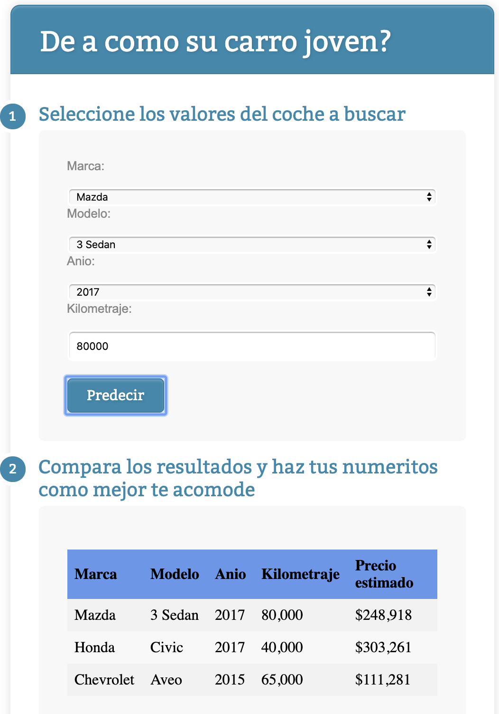

# mx-car-prices

## Intro
Este es un proyecto con intención de servir como práctica a principiantes en Machine Learning / Data Engineering / Data Science. El objetivo es lograr generalizar un modelo en base a información de anuncios en internet para conocer el precio estimado de un coche, dada su información de fabricante, modelo, año y kilometraje.

## Herramientas y prerrequisitos
Para ejecutar localmente este contenido, se debe instalar en la computadora lo siguiente:

1. Python 3 (recomendado a la fecha de hoy, 3.7)
2. pip

### Para instalar los paquetes y requerimientos
Ejecutar lo siguiente después de haber descargado el repositorio y navegar en la terminal hasta la carpeta raíz del repositorio.
```
python3 -m venv carvenv
source carvenv/bin/activate
pip install --upgrade pip
pip install -r requirements.txt
jupyter kernel install --name "carvenv" --user
deactivate
```
Esto es para que los paquetes y dependencias instalados como parte de este repositorio estén contenidos solamente en este directorio, y no se instalen globalmente para toda la computadora, y evitar, por ejemplo, conflictos entre versiones distintas de un mismo paquete, o si algún otro proyecto usa otra versión de Python.

### Para activar y desactivar el ambiente virtual (con Jupyter notebooks)
Antes de comenzar a trabajar (una vez instalados lo anterior) hay que activar el ambiente virtual creado, y también inicializar Jupyter.
```
source carvenv/bin/activate
jupyter notebook
```

Para terminar (detener) Jupyter, y desactivar el ambiente virtual, se puede cerrar la terminal en la que se ejecutó.
Opcionalmente, si no se quiere cerrar la terminal, hay que presionar la combinación de teclas `<Ctrl+C>` en la terminal para cerrar Jupyter notebooks, y para desactivar el ambiente virtual, después de terminar Jupyter, ejecutar el comando:
```
deactivate
```

## Ejecutar la aplicación web localmente

1. Activar ambiente virtual de Python para este repositorio (`source carvenv/bin/activate`)
2. Navegar al directorio `app` en este repositorio (`cd app/`)
3. Ejecutar `python carrito_server.py`
4. En un navegador (recomendación: Chrome) ingresar a la siguiente dirección: http://localhost:54345

